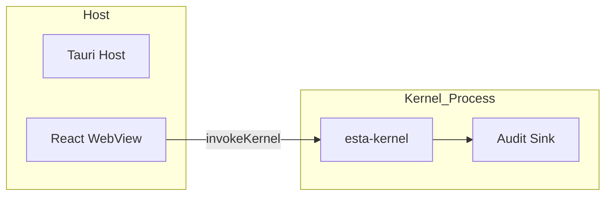

# Migration Guide: WASM-Native Microkernel Architecture

This guide outlines the migration path from the current architecture to the WASM-native microkernel architecture. Follow the phases in order to ensure a smooth transition.

---

## Prerequisites

- Gleam toolchain (for estalogic_kernel)
- Rust toolchain (stable, with `wasm32-unknown-unknown` target)
- Node.js 18+ with npm
- Tauri CLI (`cargo install tauri-cli`)

---

## Phase 0 (P0): Foundation Setup

### Objectives

- Install required toolchains
- Verify build environment

### Steps

```bash
# Install Gleam (for kernel development)
# See: https://gleam.run/getting-started/installing/

# Install Rust wasm target (for WASM modules)
rustup target add wasm32-unknown-unknown

# Install Tauri CLI for desktop app development
cargo install tauri-cli

# Install project dependencies
npm ci

# Verify installations
gleam --version
rustc --version
cargo tauri --version
```

### Acceptance Criteria

- [ ] `gleam --version` returns a valid version
- [ ] `rustup target list --installed` includes `wasm32-unknown-unknown`
- [ ] `cargo tauri --version` returns a valid version

---

## Phase 1 (P1): Kernel Bootstrap

### Objectives

- Build the estalogic_kernel Gleam crate
- Verify kernel initialization

### Steps

```bash
# Navigate to kernel directory
cd estalogic_kernel

# Build the kernel
gleam build

# Run kernel unit tests
gleam test
```

### Acceptance Criteria

- [ ] `gleam build` completes without errors
- [ ] `gleam test` passes all unit tests
- [ ] JavaScript output is generated in `build/` directory

---

## Phase 2 (P2): WASM Module Compilation

### Objectives

- Compile accrual logic to WASM
- Verify WASM module loads correctly

### Steps

```bash
# From repository root
npm run wasm:build

# Run WASM tests
npm run wasm:test
```

### Acceptance Criteria

- [ ] WASM build completes without errors
- [ ] WASM tests pass with no failures

---

## Phase 3 (P3): Tauri Integration

### Objectives

- Configure Tauri host application
- Integrate WASM modules with kernel
- Verify end-to-end communication

### Steps

```bash
# From repository root
# Start Tauri development server
npm run tauri:dev

# Or build for production
npm run tauri:build
```

### Acceptance Criteria

- [ ] Tauri app launches successfully
- [ ] React WebView renders without errors
- [ ] Kernel responds to `invokeKernel` calls from UI
- [ ] Audit events are emitted and logged
- [ ] CSP headers are correctly applied (no inline script violations)

---

## Verification Commands

### Full Build Pipeline

```bash
# From repository root
npm run wasm:build       # Build WASM modules
npm run wasm:test        # Test WASM modules
npm run tauri:build      # Build Tauri application
npm run test             # Run test suites
```

### Security Audit

```bash
# Run cargo audit for Rust dependencies
cargo audit

# Run npm audit for JavaScript dependencies
npm audit
```

---

## Rollback Procedure

If migration fails at any phase:

1. **P0-P1**: No application changes; simply remove Gleam artifacts with `rm -rf build/`
2. **P2**: Clean WASM build outputs with `nx reset`
3. **P3**: Revert Tauri configuration and restore previous deployment

---

## Architecture Reference

See [docs/diag/microkernel.mmd](./diag/microkernel.mmd) for the architecture diagram.



---

## Support

For issues during migration, open a GitHub issue with:

- Phase where failure occurred
- Full command output
- System information (`gleam --version`, `rustc --version`, `node --version`)
